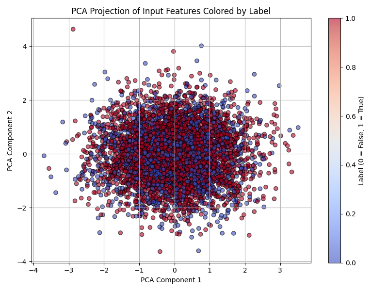
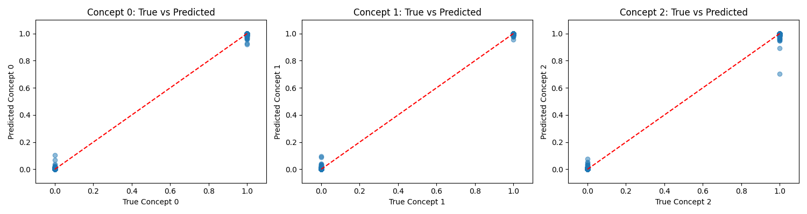
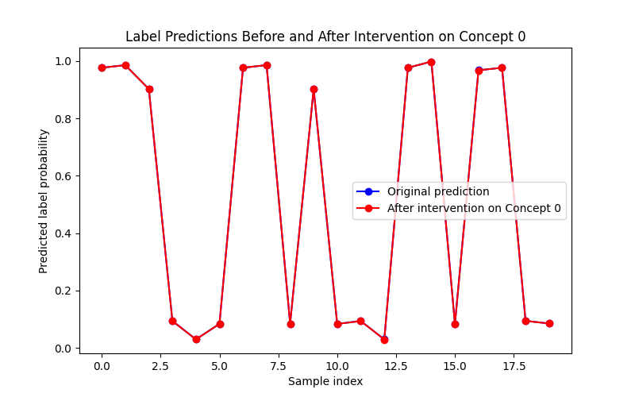
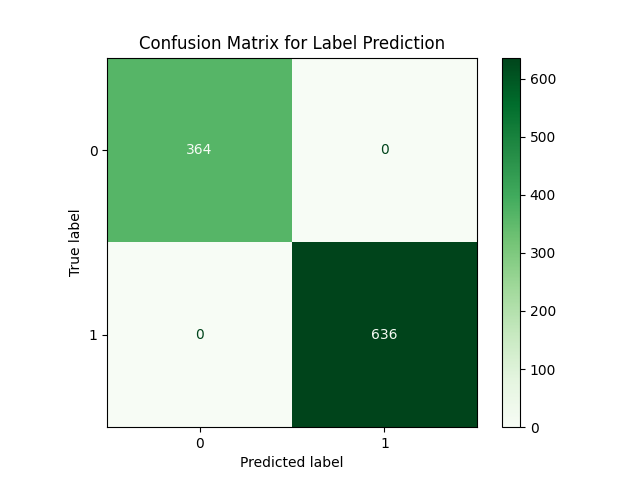
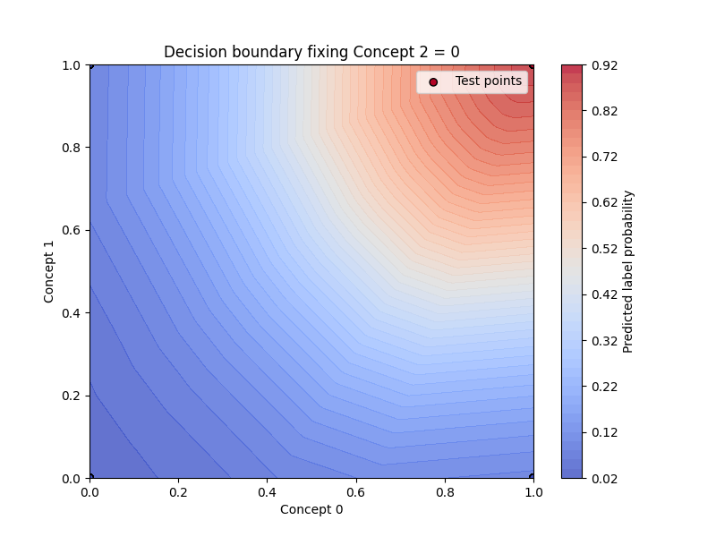

# Concept Bottleneck Model (CBM) with Synthetic Data

This project demonstrates a Concept Bottleneck Model (CBM) using synthetic data to explore model interpretability and the effect of concept-level interventions on predictions.

---

## 🧠 Project Overview

A CBM splits prediction into two stages:

1. **Concept Encoder**: Predicts interpretable *concepts* from input features.
2. **Label Predictor**: Predicts the final *label* based on those concepts.

This makes the decision-making process more transparent and allows for **human intervention** at the concept level to change or correct model predictions.

---

## 🧪 Data Generation

We simulate 3 binary **concepts** (`c0`, `c1`, `c2`) and a final **label** based on the logic:


The input `x` consists of:
- Noisy versions of the 3 concepts
- 7 irrelevant noise features

---

## 🏗️ Model Architecture

- **Concept Encoder**: A neural network that maps 10D inputs → 3D concept predictions.
- **Label Predictor**: A second neural network that maps predicted concepts → binary label.
- **CBM**: Full pipeline: `x → ĉ → ŷ`.

---

## 🎯 Training Procedure

1. The concept encoder is **trained with supervision** on the true concepts.
2. After training, the encoder is **frozen** to ensure concept interpretability.
3. The label predictor is then trained on the predicted concepts.

---

## 📊 Visualizations & Analysis

### 1. PCA Projection

PCA is applied to 10D input space to show that the features partially separate based on the label:



---

### 2. Concept Prediction Accuracy

Scatter plots compare **predicted vs true concepts** for the test set:



> The predictions are accurate and track closely with true values, especially for `c2`.

---

### 3. Intervention Analysis

To test interpretability, we **manually correct one concept at a time** and observe the effect on the label prediction.

**Results:**

| Concept | Avg. Prediction Change After Intervention |
|---------|-------------------------------------------|
| c0      | ~0.15                                     |
| c1      | ~0.22                                     |
| c2      | ~0.41                                     |

> Intervening on `c2` has the largest effect on final prediction, reflecting its role in the logical label rule.

Sample visualization:



---

### 4. Confusion Matrices

- **Concept confusion matrices** show high binary accuracy for concept predictions.
- **Label confusion matrix** reflects overall task performance.



---

### 5. Decision Boundaries

Decision boundaries of the label predictor in concept space are plotted by fixing one concept and varying the other two:



> The decision regions align well with the underlying label logic.

---

## ✅ Key Takeaways

- The CBM successfully learns interpretable intermediate concepts.
- Intervening on learned concepts directly changes model predictions in intuitive ways.
- Visualizations confirm both good concept learning and decision boundary alignment with ground truth logic.

---

## 🛠️ Dependencies

- Python 3.8+
- TensorFlow / Keras
- NumPy, scikit-learn
- Matplotlib, Seaborn

Install with:

```bash
pip install -r requirements.txt
